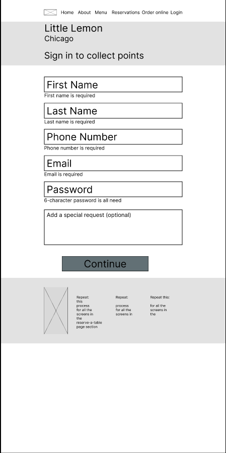

## Check out the [Figma prototype design for little lemon](https://www.figma.com/design/u7zbSHNIFWE0rwz6fZt178/high-fidelity-visual-design?node-id=0-1&t=3uFdohozHKiRJpxq-1)

    
    
    

## Check out the [Figma wireframes for little lemon](https://www.figma.com/design/uPCi7Jnts19XhE4eME3VZU/wireframes?node-id=0-1&t=kXbcadpiKyPjSc9k-1)

## Check out the [Figma prototype for little lemon capstone project](https://www.figma.com/design/Jo78tKGLI9UtpjAV1VFX8w/Capstone-project?node-id=25-378&t=YkVTrjlAuomzVeLG-1)

    
    
    

## Check out the [Figma wireframes for little lemon capstone project](https://www.figma.com/design/Jo78tKGLI9UtpjAV1VFX8w/Capstone-project?node-id=0-1&t=YkVTrjlAuomzVeLG-1)

    
    
    

### figma_designs and README.md were auto created using createRepo command in [*Custom Commands*](https://github.com/DafetiteOgaga/custom_commands)
		

###### *We Rise by Lifting Others.*
